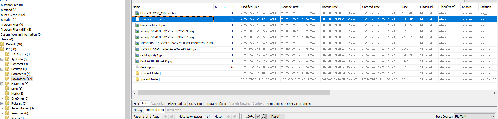
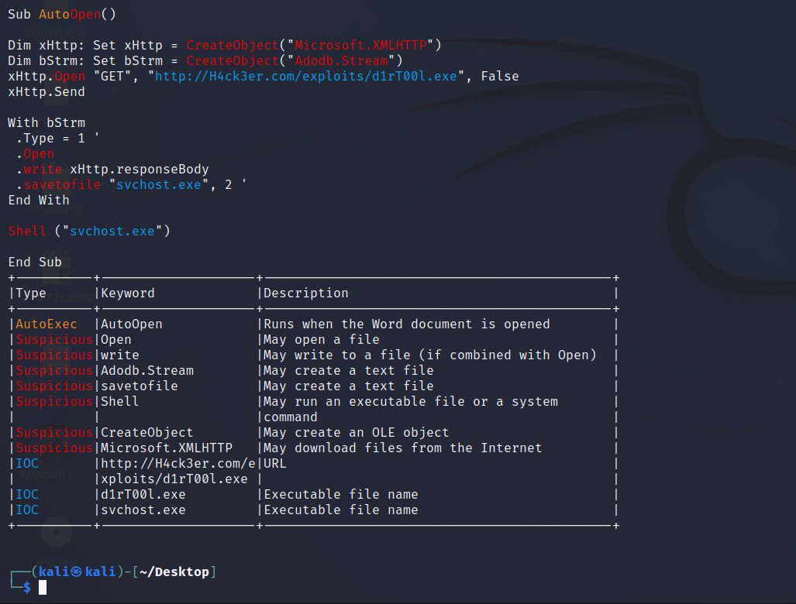

# Challenge name

## Write-up

Eva was attacked by a ransomware after downloading the slides, that means this ransom was initiated by macros.

1. Using Autopsy, extract the Powerpoint file from Downloads:



2. Examine the file using `Ole Tools`:
```code
olevba industry.pptm
```




## Flag

`shellmates{H4ck3r.com_d1rT00l.exe_svchost.exe}`
