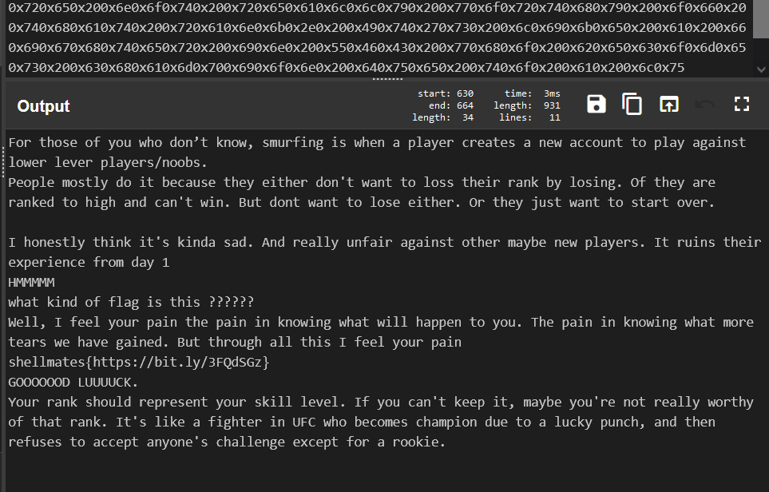
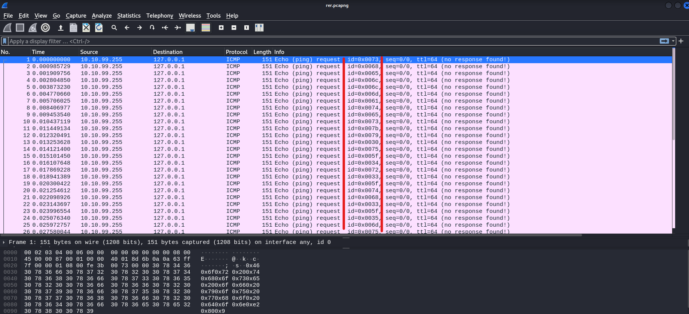

# Challenge name

## Write-up

Let's extract the the raw data from ICMP packets using `Scapy`

```python
f = rdpcap('Desktop/smurf.pcapng')

for ff in f:
  print(ff.load.decode('utf8'))
  ```
Output: hexadecimal values.
```code
0x460x6f0x720x200x740x680x6f0x730x650x200x6f0x660x200x790x6f0x750x200x770x680x6f0x200x640x6f0x6e0xe20x800x9
90x740x200x6b0x6e0x6f0x770x2c0x200x730x6d0x750x720x660x690x6e0x670x200x690x730x200x770x680x650x6e0x200x610x
200x700x6c0x610x790x650x720x200x630x720x650x610x740x650x730x200x610x200x6e0x650x770x200x610x630x630x6f0x750
x6e0x740x200x740x6f0x200x700x6c0x610x790x200x610x670x610x690x6e0x730x740x200x6c0x6f0x770x650x720x200x6c0x65
0x760x650x720x200x700x6c0x610x790x650x720x730x2f0x6e0x6f0x6f0x620x730x2e0x0a0x500x650x6f0x700x6c0x650x200x6
d0x6f0x730x740x6c0x790x200x640x6f0x200x690x740x200x620x650x630x610x750x730x650x200x740x680x650x790x200x650x
690x740x680x650x720x200x640x6f0x6e0x270x740x200x770x610x6e0x740x200x740x6f0x200x6c0x6f0x730x730x200x740x680
x650x690x720x200x720x610x6e0x6b0x200x620x790x200x6c0x6f0x730x690x6e0x670x2e0x200x4f0x660x200x740x680x650x79
0x200x610x720x650x200x720x610x6e0x6b0x650x640x200x740x6f0x200x680x690x670x680x200x610x6e0x640x200x630x610x6
e0x270x740x200x770x690x6e0x2e0x200x420x750x740x200x640x6f0x6e0x740x200x770x610x6e0x740x200x740x6f0x200x6c0x
6f0x730x650x200x650x690x740x680x650x720x2e0x200x4f0x720x200x740x680x650x790x200x6a0x750x730x740x200x770x610
x6e0x740x200x740x6f0x200x730x740x610x720x740x200x6f0x760x650x720x2e0x0a0x0a0x490x200x680x6f0x6e0x650x730x74
0x6c0x790x200x740x680x690x6e0x6b0x200x690x740x270x730x200x6b0x690x6e0x640x610x200x730x610x640x2e0x200x410x6
e0x640x200x720x650x610x6c0x6c0x790x200x750x6e0x660x610x690x720x200x610x670x610x690x6e0x730x740x200x6f0x740x
680x650x720x200x6d0x610x790x620x650x200x6e0x650x770x200x700x6c0x610x790x650x720x730x2e0x200x490x740x200x720
x750x690x6e0x730x200x740x680x650x690x720x200x650x780x700x650x720x690x650x6e0x630x650x200x660x720x6f0x6d0x20
0x640x610x790x200x310x0a0x480x4d0x4d0x4d0x4d0x4d0x0a0x770x680x610x740x200x6b0x690x6e0x640x200x6f0x660x200x6
60x6c0x610x670x200x690x730x200x740x680x690x730x200x3f0x3f0x3f0x3f0x3f0x3f0x0a0x570x650x6c0x6c0x2c0x200x490x
200x660x650x650x6c0x200x790x6f0x750x720x200x700x610x690x6e0x200x740x680x650x200x700x610x690x6e0x200x690x6e0
x200x6b0x6e0x6f0x770x690x6e0x670x200x770x680x610x740x200x770x690x6c0x6c0x200x680x610x700x700x650x6e0x200x74
0x6f0x200x790x6f0x750x2e0x200x540x680x650x200x700x610x690x6e0x200x690x6e0x200x6b0x6e0x6f0x770x690x6e0x670x2
00x770x680x610x740x200x6d0x6f0x720x650x0a0x740x650x610x720x730x200x770x650x200x680x610x760x650x200x670x610x
690x6e0x650x640x2e0x200x420x750x740x200x740x680x720x6f0x750x670x680x200x610x6c0x6c0x200x740x680x690x730x200
x490x200x660x650x650x6c0x200x790x6f0x750x720x200x700x610x690x6e0x0a0x730x680x650x6c0x6c0x6d0x610x740x650x73
0x7b0x680x740x740x700x730x3a0x2f0x2f0x620x690x740x2e0x6c0x790x2f0x330x460x510x640x530x470x7a0x7d0x0a0x470x4
f0x4f0x4f0x4f0x4f0x4f0x440x200x4c0x550x550x550x550x430x4b0x2e0x0a0x590x6f0x750x720x200x720x610x6e0x6b0x200x
730x680x6f0x750x6c0x640x200x720x650x700x720x650x730x650x6e0x740x200x790x6f0x750x720x200x730x6b0x690x6c0x6c0
x200x6c0x650x760x650x6c0x2e0x200x490x660x200x790x6f0x750x200x630x610x6e0x270x740x200x6b0x650x650x700x200x69
0x740x2c0x200x6d0x610x790x620x650x200x790x6f0x750x270x720x650x200x6e0x6f0x740x200x720x650x610x6c0x6c0x790x2
00x770x6f0x720x740x680x790x200x6f0x660x200x740x680x610x740x200x720x610x6e0x6b0x2e0x200x490x740x270x730x200x
6c0x690x6b0x650x200x610x200x660x690x670x680x740x650x720x200x690x6e0x200x550x460x430x200x770x680x6f0x200x620
x650x630x6f0x6d0x650x730x200x630x680x610x6d0x700x690x6f0x6e0x200x640x750x650x200x740x6f0x200x610x200x6c0x75
0x630x6b0x790x200x700x750x6e0x630x680x2c0x200x610x6e0x640x200x740x680x650x6e0x200x720x650x660x750x730x650x7
30x200x740x6f0x200x610x630x630x650x700x740x200x610x6e0x790x6f0x6e0x650x270x730x200x630x680x610x6c0x6c0x650x
6e0x670x650x200x650x780x630x650x700x740x200x660x6f0x720x200x610x200x720x6f0x6f0x6b0x690x650x2e
```

`HEX => Text`


`
shellmates{https://bit.ly/3FQdSGz}`

Rickroll ( ͡• ͜ʖ ͡• ), Let's try another way.

As we can see, there is a specious `ID` field in `packet info` in wireshark.

we can check it out using `Scapy` again:
```python
flag =''
for ff in f:
    flag = flag + str(ff['ICMP'].id) + " "
print(flag)
```
output:
```code
'115 104 101 108 108 109 97 116 101 115 123 121 48 117 95 52 114 51 95 116 104 51 95 53 109 117 114 102 95 99 104 52 109 112 125 '
```
After decoding these decimal values you will get the flag:


## Flag

`shellmates{y0u_4r3_th3_5murf_ch4mp}`
