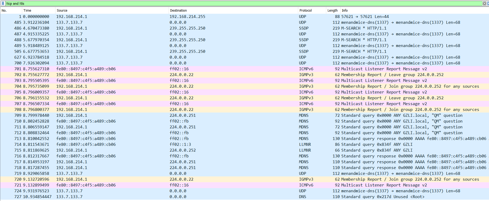
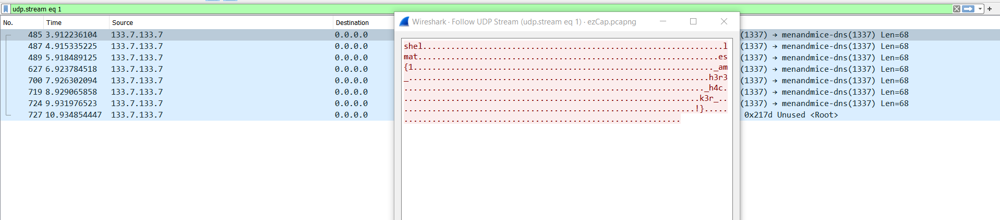

# ezCap

## Write-up

* first, HTTPS traffic looks authentic, we can filter it by: 
```code
  !tcp and !tls
```



weird `UDP` traffic with `1337` port.
select the packet => `Follow`=>`UDP stream`.


## Flag

`shellmates{1_am_h3r3_h4ck3r_!}`
