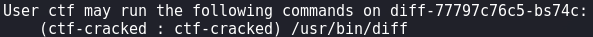
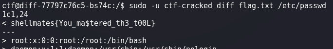

# diff

## Write-up

After accessing the system, we can see that the *flag.txt* file can only be read by `root` user and `ctf-cracked` group. 
By executig `id` command, we see that we're logged in as the user `ctf` that doesn't belong to `ctf-cracked` group but belongs to `sudo` group. 
Let's see what can the `ctf` user execute using `sudo` :  
  
We can execute *diff* command as `ctf-cracked` user, so we have to find a way to read the *flag.txt* file using this command.
Since *diff* command shows the differences between the content of two given files, it is sufficient to compare the *flag.txt* file with any other existing accessible file that has different content.

## Payload
```bash
sudo -u ctf-cracked diff flag.txt /etc/passwd
```


## Flag

`shellmates{You_ma$tered_th3_t00L}`

