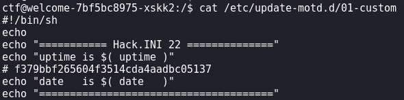

# welcome

## Write-up

After accessing the system, we get this welcome message :  
  
We notice that the welcome message is customized and based on the title of this challenge *welcome*, if we search, we can find that it's possible to make scripts that get executed once a user logs in. These scripts are located in **/etc/update-motd.d/**. If we check this folder, we will find a file that looks interesting `custom` . If we open it, we will indeed find the welcome message plus an interesting comment that represents the flag.  
  
then wrap shellmates with the `f379bbf265604f3514cda4aadbc05137`.

## Payload
```bash
cat /etc/update-motd.d/01-custom
```

## Flag

`shellmates{f379bbf265604f3514cda4aadbc05137}`

