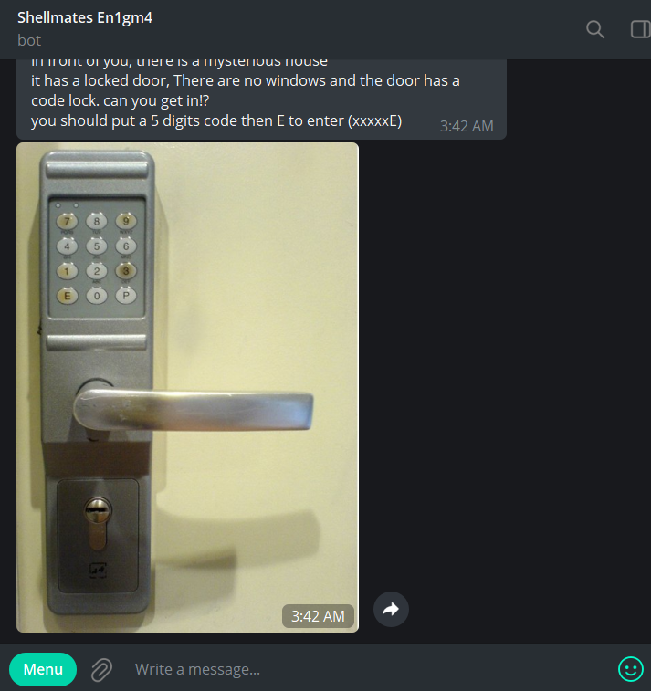
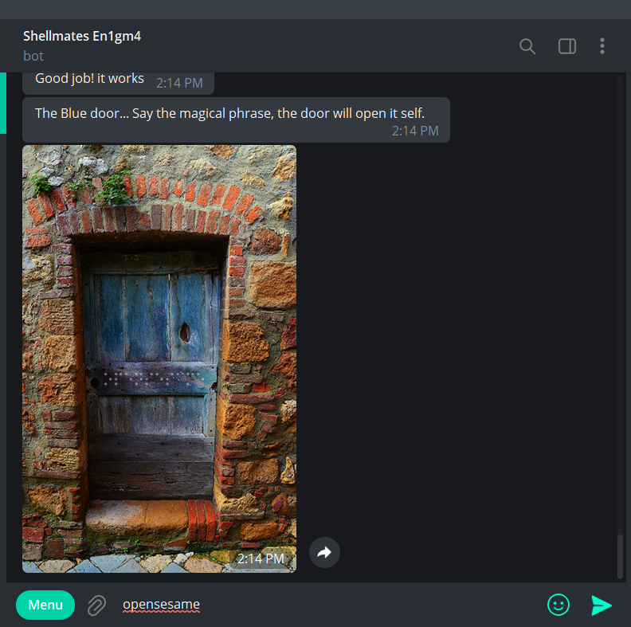
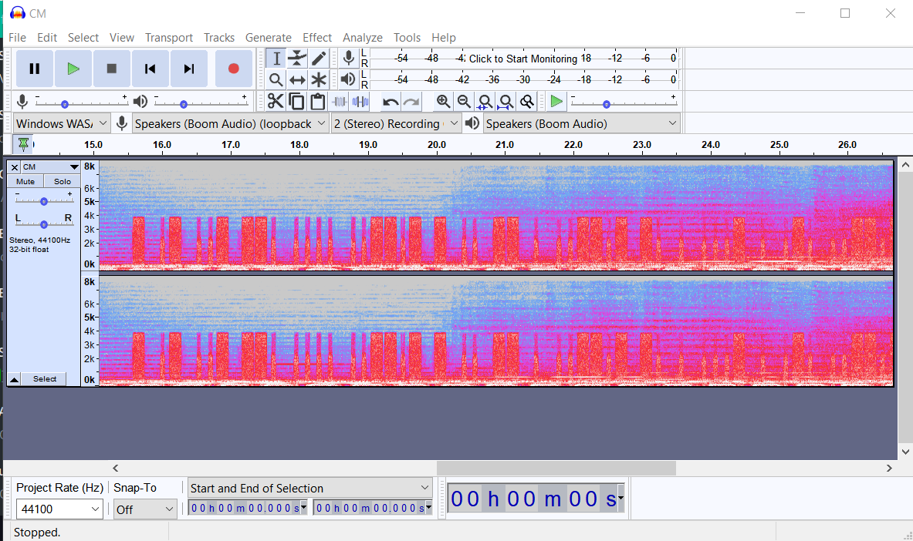
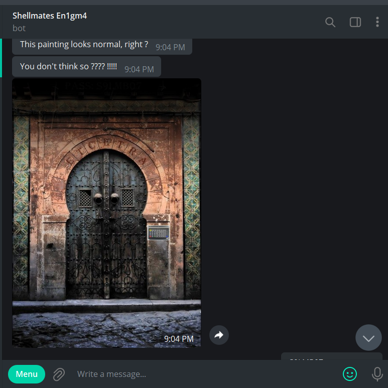
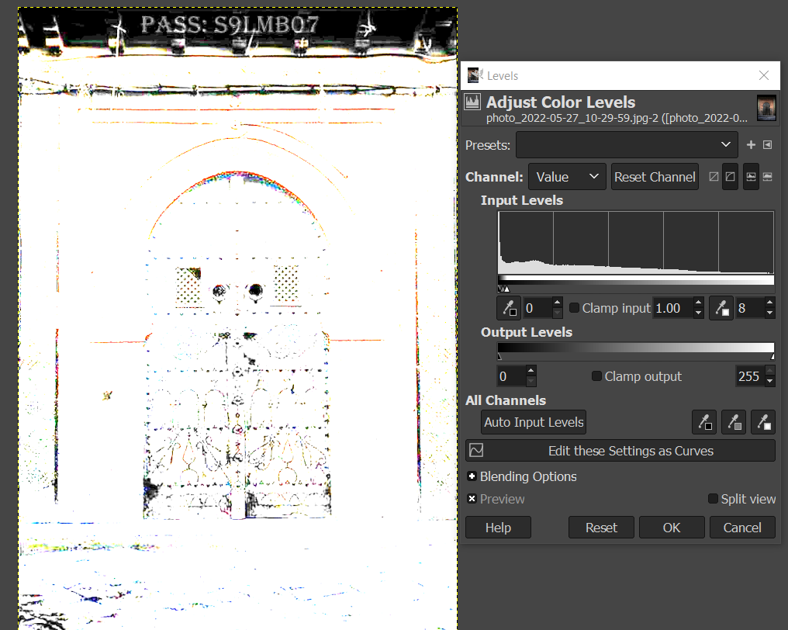
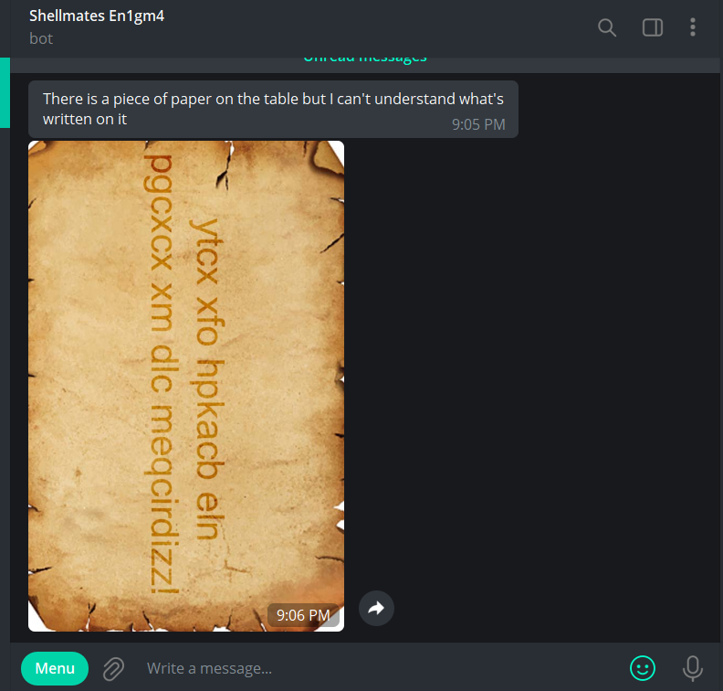
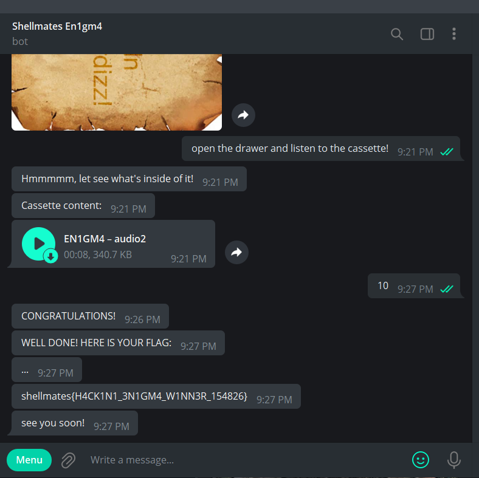

# Enigma

## Write-up
## Level 1:

- Lock code: ``13379E``

## Level 2:

- There is Braille code on the door by decoding it we'll get the magical phrase: ``opensesame``

## Level 3:

- this audio contains morse code, you can easily view it using ``audacity``.
there is so many online tools that do the job,
passphrase: ``TAUGH_TIME_NEVER_LAST``. (i knw it should be Tough not Taugh XD)

## Level 4:

- by changing the levels using any photo editor: 

passphrase: ``S9LMB07``

## Level 5:

- Vigenere cipher : ``open the drawer and listen to the cassette!``

## Final level:

- After reversing the audio at the first time you may hear ``30 cows in a field, 28 chickens how many didn't``, in fact it's ``30 cows in a field, 20 ate chicken how many didn't`` and obviously the answer is: ``10``.

after solving all this challs the bot will bring you the flag.

## Flag

`shellmates{H4CK1N1_3N1GM4_W1NN3R_154826}`
