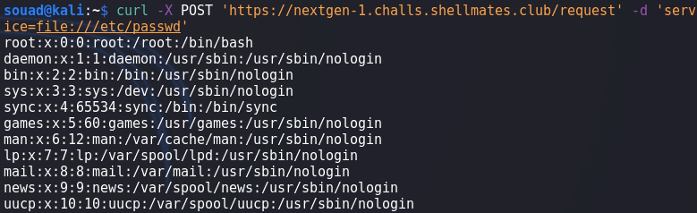

# nextGen 1

## Write-up

### Exploration
After somet time exploring the application, we find this JavaScript code :

We can read that the function myFunc is being executed everytime an HTML element that belongs to `department` class is clicked. The function sends a the value of the attibute `link` of the clicked element via POST request to */request*.
After looking at the HTML source code, only two elemnts belongs to `department` class :

These elements consist the naviagtio bar of the application, we can see that the `link` attribute value is a certain URL to a certain subdomain.
By clicking on `Accounting Department` and `HR Department` in navigation bar and inspecting the requests we get :


### Exploitation
1. Since the application is sending a URL to the server, maybe the server is making requests to this domain, hence a possibility of an **SSRF** (Server Side Request Forgery), let's test it.
2. To test it, we can create our own HTTP server and use a tool like `ngrok` to access it from the internet :

as we can see, the web application really made a request to our server, so it is an SSRF !
3. We return back to the challenge, from the hint, we read that the flag is in a file located on the web server :

4. Until now, we only sent HTTP requests through the web server, but we didn't read any local files, to achieve this, we can use the **file URI scheme** if it's allowed, it can access files located on the local host. Since the web server is itself making the request, so if the `file` scheme is allowed, then we should be able to access the files that the web server has access to. Let's test it:

It worked.

### Final payload
```bash
curl -X POST 'https://nextgen-1.challs.shellmates.club/request' -d 'service=file:///flag.txt'
``` 

### Mitigation
The user should have used a strict regex with the whitelisted subdomains that web server needed to access. Also, we can add a security layer by adding some firewall rules to allow requests to only trusted domains.

## Flag

`shellmates{1T_W4S_4_qu1T3_3s4y_expl01tabL3_$$Rf}`


