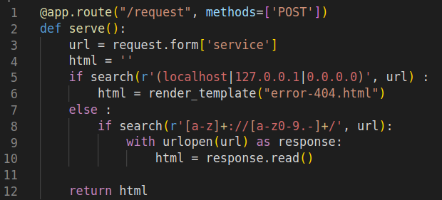

# nextGen 2

## Write-up

### Exploration
The web application is the same as the one used in nextGen 2, except that some filters are used on the URL passed to the app. Here is the `filters` file shared : \
 \
Let's analyze it :
- We can recognize from the syntax that python is the programming language used.
- A 404 Error is sent if the received data contains one of the words : localhost, 127.0.0.1, 0.0.0.0
(I want to note that I made an error on the regex, so it doesn't exactly match this, the errors made will be discussed later on).
- The server will request the received domain only if it contains the sequence `something://something/`
At first glance, the developer is trying to avoid an SSRF attack by trying to validate the user inputs. 

### Exploitation
If we try to use the previous payload which is :
```bash
curl -X POST '[DOMAIN]/request' -d 'service=file:///flag.txt'
``` 
It won't work because the second regex isn't matched, there is no sequence `something://something/`.
This can be easily bypassed by adding the *authority* to the URI which becomes :
`file://authority_here/flag.txt`.
Next we have to find an *authority* that points internally to the server like : `127.0.0.1` or `localhost`, but these are blacklisted. Many exploits may bypass this restriction since the loopback address may be represented in many ways depending on the system and software used, as `127.0.1` (using zero compression) or a hex representation like `0x7f.0x0.0x0.0x1`, we can find more payloads in this [website](https://www.hacksparrow.com/networking/many-faces-of-ip-address.html).


### Final payload
```bash
curl -X POST 'https://nextgen-2.challs.shellmates.club/request' -d 'service=file://127.1/flag.txt'
``` 

### Mistakes made and unintended solutions
In the second regex, it's enough to find a sequence `something://something/` anywhere in the received data, another solution : `file:///flag.txt#a://x/` where we exploit the URI syntax by adding a *fragment* with the `#`, following it by the `a://x/` which will pass the second regex.

### Mitigation
The user should have used a strict regex with the whitelisted subdomains that web server needed to access. Also, we can add a security layer by adding some firewall rules to allow requests to only trusted domains.

## Flag

`shellmates{Y0u_d1D_1t_aG4iN_!!}`
