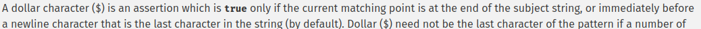
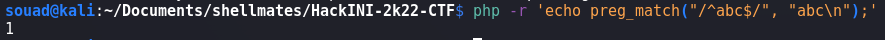
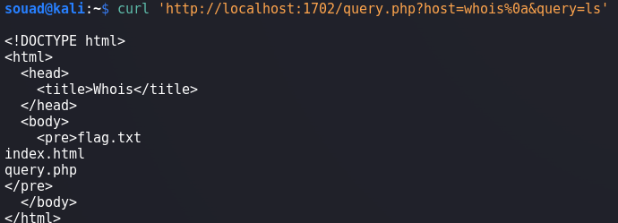

# Whois

## Write-up

1. After reviewing the HTML code of the provided page, we cansee the form is posting two information to a `/query.php` page : query and host.
2. We navigate to this page using an HTTP GET, we get the source code of the page.
3. We can see that the two parameters *host* and *query* are passed to `preg_match` function in order to sanitize them before sending them to the command.
4. At first glance, for the *host* parameter, the regular expression is letting only alphnumerical characters, dash and dot, it is also enforcing the first character to be alphanumerical. For the *query* parameter, the regular expression is letting only alphnumerical characters, dash and space.
5. Giving the regular expressions a first look, nothing seems odd, only dash, space and dot as special charcaters are allowed.
6. But if we read the PHP documentation about regular expressions syntax we can read this :

7. As we can read this `A dollar character ($) is an assertion which is true only if the current matching point is at the end of the subject string, or immediately before a newline character that is the last character in the string (by default)` so if a newline is the last character in the string, the anchor is going to be true and evaluates the regex with what comes before the newline. 
8. For example, if we pass the string 'abc\n' to the regex '/^abc$/', the result is going to be true.
Here is the test :  \
the result `1` means that the regex matched the provided string.
9. This way, we can get a command injection by exploiting this mistake, we can send a newline at the end of *host* parameter which is going to be approved by the regex and next send in the *query* parameter, the command we want to execute. I note that a newline in an unquoted argument is interpreted by the shell as a splitter between commands, so what comes after the newline is considered as another command.
10. Let's build the payload, for the host parameter, as the regex constraints it, the parameter has to be at least 2 chars. we can choose any random two alphabets, after that, we need to end the string with a newline, but we have to urlencode it first, the urlencoding of newline is `%0a`, so the parameter *host* will be : `ab%0a`.
11. The second parameter will be our command to be executed : `ls`
12. We get this :
 \
At this point, we got a command injection by listing all the files.

## Final payload
```bash
curl -v '[DOMAIN]?host=whatever%0a&query=cat%20flag.txt'
```

## Flag

`shellmates{i_$h0U1D_HaVE_R3AD_7HE_dOc_W3Ll}`
